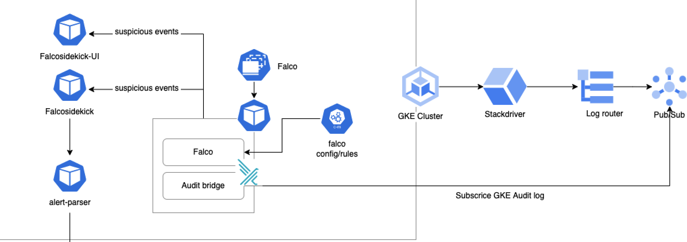

# falco-deployment
## Architecture

## Prerequisites
1. set variable name for Pub/Sub (Topic, Subscription), Log Sink, Service Account
2. Provision resource (Pub/Sub, Log Sink and Service account) using Terraform in directory `/prerequisites/terraform`
3. Get Service Account key, encrypt with SealedSecret
4. Set Pub/Sub name and Service Account's SealedSecret data in `values.yaml/<env>.yaml` (under gkeAuditBridge key) in directory `falco`
5. Set webhook address data for alert in `values.yaml` in directory `falcosidekick`

## Installation

``` helm upgrade -i falco ./falco --set auditLog.enabled=true --set ebpf.enabled=true --set falcosidekick.enabled=true --set falcosidekick.webui.enabled=true --namespace falco -f falco/values.yaml``` 

## Falco Rules
``` 
Falco rules stored in rules directory (falco/rules), and being called from Falco configuration in falco.yaml
```


